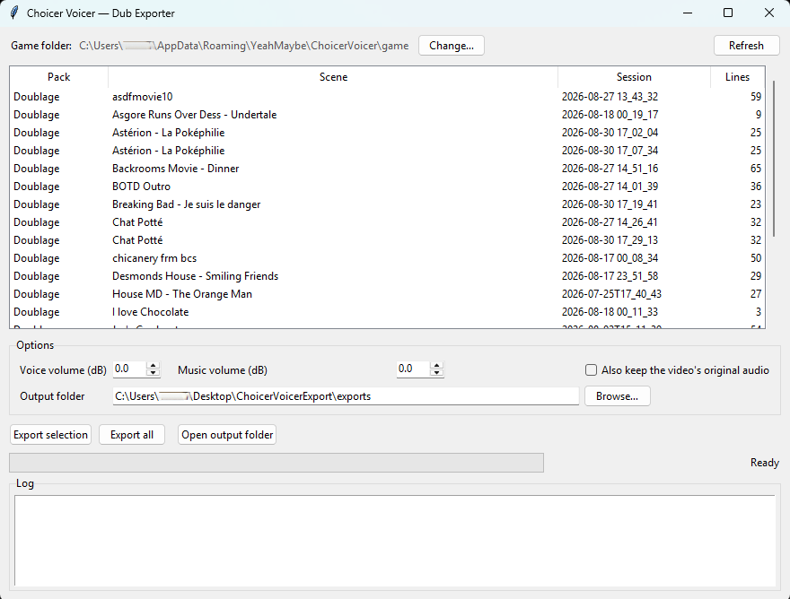

# Choicer Voicer Dub Exporter

Export your [The Choicer Voicer](https://yeahmaybe.itch.io/the-choicer-voicer/) dub recordings as shareable MP4 videos.

The game lets you dub over video scenes with your own voice, but the results can only be
played back in-game: your recordings are stored as bare audio files, and the game merges
them with the video on the fly. This tool does the same merge offline with ffmpeg, so you
can keep and share your dubs as regular video files.



## Features

- Lists every dub session found in the game's data folder
- Mixes your voice recordings at their exact in-scene timestamps over the scene video
  and its backing track (music/SFX), just like the game does
- GUI with multi-select, per-file progress bar and log
- Volume controls for voices and music (in dB)
- Handles old and new pack formats (`.txt` / `.ini` metadata), scenes without a backing
  track, and scenes whose video has no audio stream at all
- Output is standard MP4 (H.264 + AAC)

## Requirements

- **Windows** with **Python 3.8+** (Tkinter included, no extra packages needed)
- **ffmpeg** and **ffprobe** available in your `PATH`
  (`winget install ffmpeg` does the job)
- The Choicer Voicer installed, with at least one dub recorded

## Usage

### GUI

Double-click **`Dub Exporter.pyw`** (no console window), or run:

```
pythonw export_dub_gui.py
```

Select one or more sessions, tweak the options if you want, then hit **Export selection**
(or just double-click a session in the list). Files land in the `exports/` folder by default.

### CLI

```
python export_dub.py --list          # list available sessions
python export_dub.py -n 3            # export session #3
python export_dub.py --all           # export everything
python export_dub.py                 # interactive menu
```

Options: `--game DIR` (game folder), `--out DIR` (output folder), `--voice-gain DB`,
`--music-gain DB`, `--original-audio` (also keep the video's original audio).

## How it works

The game stores its data under `%APPDATA%\YeahMaybe\ChoicerVoicer\game`:

```
packs_voice/<Pack>/<Scene>/
    dub_video.ogv          # the scene video (Theora; original audio, sometimes none)
    _backing_track.mp3     # music/SFX without the voices (newer packs)
    <id>_<Char>.txt|.ini   # per-line metadata: dub_timestamps=[seconds]
recordings/dub_recordings/<Pack>/<Scene>/<Session>/
    _dubrecord_<id>_<Char>.wav   # your recordings, named after the pack's lines
```

For each session the exporter matches every `_dubrecord_*.wav` with its line metadata,
delays it to its `dub_timestamps` position (`adelay`), mixes everything with the backing
track (`amix`, with a limiter to avoid clipping), and muxes the result over the video —
re-encoded to H.264/AAC so the MP4 plays everywhere.

## Notes

- This is a fan-made tool, not affiliated with YeahMaybe / The Choicer Voicer.
- The exported video is the scene's content: only share dubs of scenes you're allowed to
  redistribute.

## License

[MIT](LICENSE)
